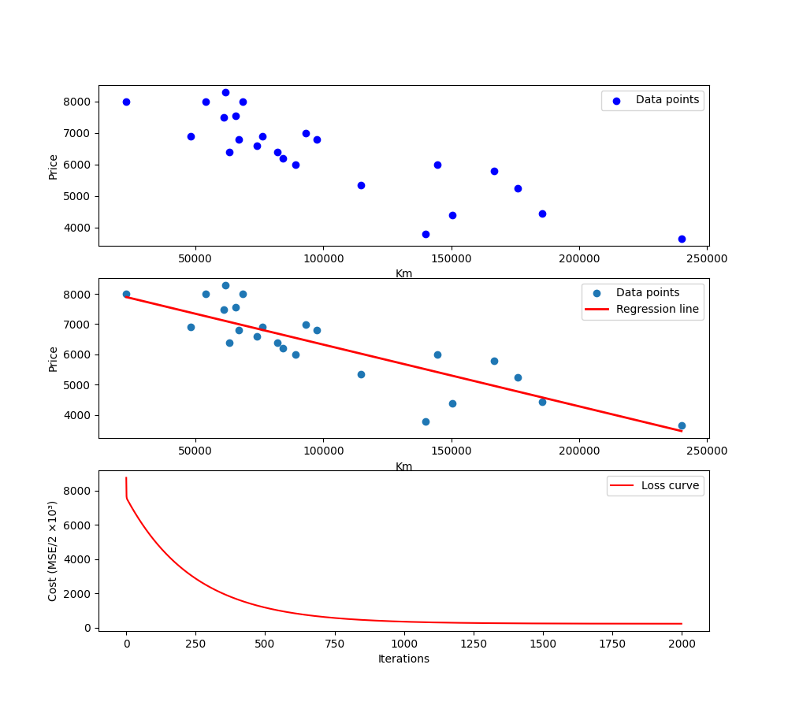
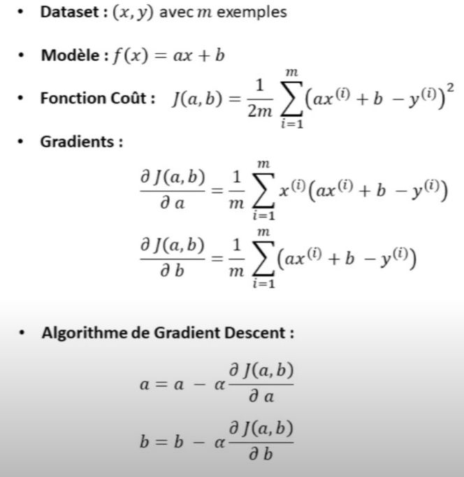
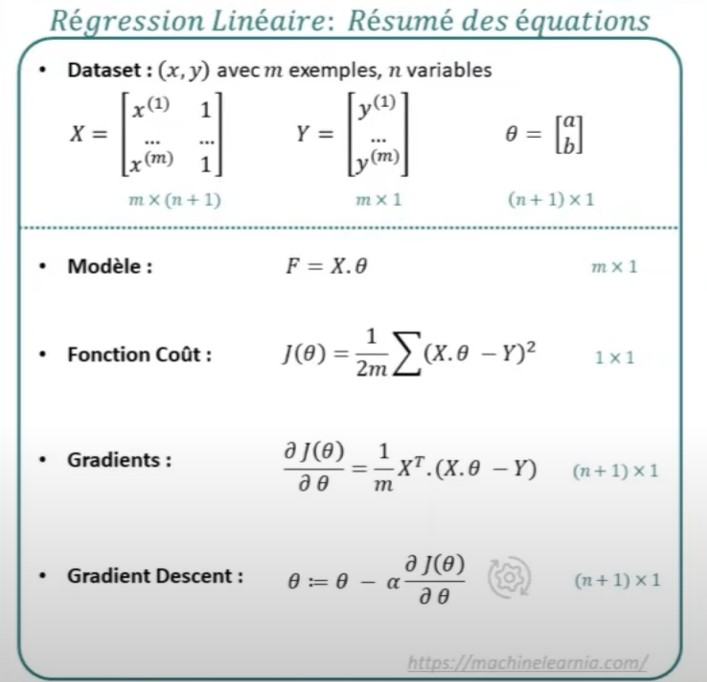

# ft_linear_regression

42School Project: Implement a simple linear regression with gradigradientnt descent

## Objective 

Prediction of car price based on mileage using a linear regression

## Introduction

Linear regression is a very simple and widely used algorithm in machine learning.
Its purpose is to model the relationship between an independent variable **x** (here, the mileage of cars) and a dependent variable **y** (the price of the car) using a linear function.

## Model

F(x) = ax + b

<u>**x**</u> → independent variable (car mileage)  
<u>**F(x)**</u> → prediction (approximate price)  
<u>**a (or θ₁)**</u> → slope of the line (impact of mileage on the price)  
<u>**b (or θ₀)**</u> → intercept (approximate price when **x = 0**)  

### Function Model in python

```python
def model(X, theta) :
	return X.dot(theta)
```

This is a matrix-vector product:

<u>**X**</u> -> matrix of shape **(m, 2)**, containing each sample **[x, 1]** (1 is for the bias term)  
<u>**theta**</u> -> parameter vector **[θ₁, θ₀]** (slope and intercept)  
<u>**X.dot(theta)**</u> -> computes the linear model ax + b for all samples  

## Cost Function

The cost function is used to compute the sum of squared errors (Euclidean norm) in linear regression.

J(θ) = 1 / 2m * ​i=1 ∑ m ​( f( x(i) ) − y(i) )2

<u>**J(θ)**</u> -> value of the cost function (sum of squared errors)  
<u>**m**</u> -> m is the total number of samples  
<u>**​i=1 ∑ m**</u> -> sum from the first sample to the last one  
<u>**f(x(i))**</u> -> prediction of the model for sample **i (f(x)=ax+b)**
<u>**y(i)**</u> -> real (true) value for sample **i**  
<u>**1 / 2**</u> -> Normalization factor (we divide by the number of samples, and the 2 simplifies the derivatives later)  

### Function Cost in python

this function name is **Mean Squared Error** (MSE)

```python
def cost_function(y, X, theta) :
	m = len(y)
	return 1 / (2*m) * np.sum((model(X, theta) - y) ** 2)
```

<u>**m**</u> → total number of samples (length of vector y)  
<u>**y**</u> → vector containing all real values (true prices of the samples)  
<u>**X**</u> → matrix of shape **(m, 2)**, containing each sample **[x, 1]** (1 is for the bias term)  
<u>**theta**</u> → vector of model parameters **[θ₀, θ₁]** (intercept and slope)  
<u>**model**(X, theta)</u> → linear regression model used to make predictions  
<u>**(model(X, theta) - y)**</u> → vector of errors (difference between predicted price and real price)  
<u>**(model(X, theta) - y)²**</u> → squared errors, penalizing large deviations  
<u>**np.sum(...)**</u> → sum of all squared errors over the dataset  
<u>**1 / (2*m)**</u> → normalization factor (divide by the number of samples, and the 2 simplifies derivative calculation for a descent)  

## Algorithms of Minimization

This part is used to compute the gradient and perform gradient descent.  
It is very important for completing the linear regression process in machine learning.

### Gradient 

represente derivee of cost function ,this objectiv is determinate direction up or down cost function for the little cost

```python
def grad(X, y, theta) :
	m = len(y)
	return 1/m * X.T.dot(model(X, theta) - y)
```
<u>**m**</u> -> m is the total number of samples **y**  
<u>**X**</u> -> matrix of shape **(m, 2)**, containing each sample **[x, 1]** (1 is for the bias term)  
<u>**X.T**</u> → **.T** is used to transpose the matrix **X** (required for the derivative algorithm in gradient computation).  
<u>**model(X, theta)**</u> → this is the linear regression model used to make predictions.  
<u>**y**</u> -> vector containing all real values (true prices of the samples)  
<u>**(model(X, theta) - y)**</u> -> vector of errors (difference between predicted price and real price)

### Gradient descent 

its purpose is to update the parameters in the opposite direction of the gradient in order to minimize the value of **J(θ).**  


```python
def gradient_descent(X, y, theta, learning_rate, n_iterations) :
	cost_history = np.zeros(n_iterations)
	for i in range(0, n_iterations) :
		theta = theta - learning_rate * grad(X, y, theta)
		cost_history[i] = cost_function(y, X, theta)
	return theta, cost_history
```


<u>**theta**</u> → vector of model parameters **[θ₀, θ₁]**(intercept and slope), updated at each iteration  
<u>**grad(X, y, theta)**</u> → gradient vector (derivative of the cost function with respect to the parameters), indicating the direction of the steepest increase of the cost  
<u>**learning_rate**</u> → hyperparameter that controls the step size of the update (too large → divergence, too small → slow learning)  
<u>**learning_rate * grad(X, y, theta)**</u> → step size in the gradient direction  
<u>**theta - ...**</u> → parameter update in the opposite direction of the gradient (because the goal is to minimize the cost function, not maximize it)  

## Coefficient of determination

The coefficient of determination **(R²)** is a value between 0 and 1 that measures how well the model predicts the target variable.  

```python
def coef_determination(y, pred) : 
	u = ((y - pred)**2).sum()
	v = ((y - y.mean())**2).sum()
	return 1 - u/v
```

<u>**y**</u> → vector of shape **(m, 1)**, containing the true values (real prices).  
<u>**pred**</u> → vector of shape (m, 1), containing the predicted values by the model.  
<u>**(y - pred)**</u> → vector of residuals (errors between real and predicted values).  
<u>**((y - pred)²).sum()**</u> → **SSR** (Sum of Squared Residuals), total squared error of the model.  
<u>**y.mean()**</u> → mean of the real values (average price).  
<u>**((y - y.mean())²).sum()**</u> → **SST** (Total Sum of Squares), variance of the data relative to the mean.  
<u>**1 - u/v**</u> → formula of the coefficient of determination **(R²)**. It measures the proportion of the variance in y explained by the model (between **0** and **1**).  

## Root Mean Squared Error (RMSE)

It is an evaluation metric that measures the typical average deviation between the values predicted by your model and the true values.

```python
def rmse(y, pred):
    return np.sqrt(np.mean((y - pred)**2))
```

<u>**y**</u> → vector of shape **(m, 1)**, containing the true values (real prices).  
<u>**pred**</u> → vector of shape **(m, 1)**, containing the predicted values by the model.  
<u>**(y - pred)**</u> → vector of residuals (errors between real and predicted values).  
<u>**(y - pred)²**</u> → squares of the residuals (large errors are penalized more strongly).  
<u>**np.mean((y - pred)²)**</u> → **MSE** (Mean Squared Error), average squared error of the predictions.  
<u>**np.sqrt(...)**</u> → square root of the MSE, which brings the error back to the same unit as y (for example, euros).  



## Glossary of Abbreviations

<u>**MSE (Mean Squared Error)**</u> -> Average of the squared differences between predicted and true values.  
<u>**RMSE (Root Mean Squared Error)**</u> -> Square root of the **MSE**, brings the error back to the same unit as y.  
<u>**R² (Coefficient of Determination)**</u> -> Proportion of the variance in **y** explained by the model (between **0** and **1**).  
<u>**SSR (Sum of Squared Residuals)**</u> -> Sum of squared differences between predicted values and true values (errors of the model).  
<u>**SST (Total Sum of Squares)**</u> -> Total variance of the data relative to the mean of **y**.  
<u>**θ₀ (theta0)**</u> -> Intercept or bias (predicted value when **x = 0**).  
<u>**θ₁ (theta1)**</u> -> Slope or weight (impact of the variable **x** on **y**).  
<u>**X.T (Transpose)**</u> -> Transpose of the matrix **X**.  
<u>**J(θ) (Cost Function)**</u> -> Function measuring the error of the model (sum of squared errors).  
<u>**Learning rate (α)**</u> -> Hyperparameter that controls the step size in gradient descent updates.  
<u>**Gradient**</u> -> Vector of partial derivatives of the cost function with respect to the parameters (direction of steepest increase).  
<u>**Epoch / Iteration**</u> -> One complete update step of the parameters during gradient descent.  

## Set of Mathematical Formulas and Programming

